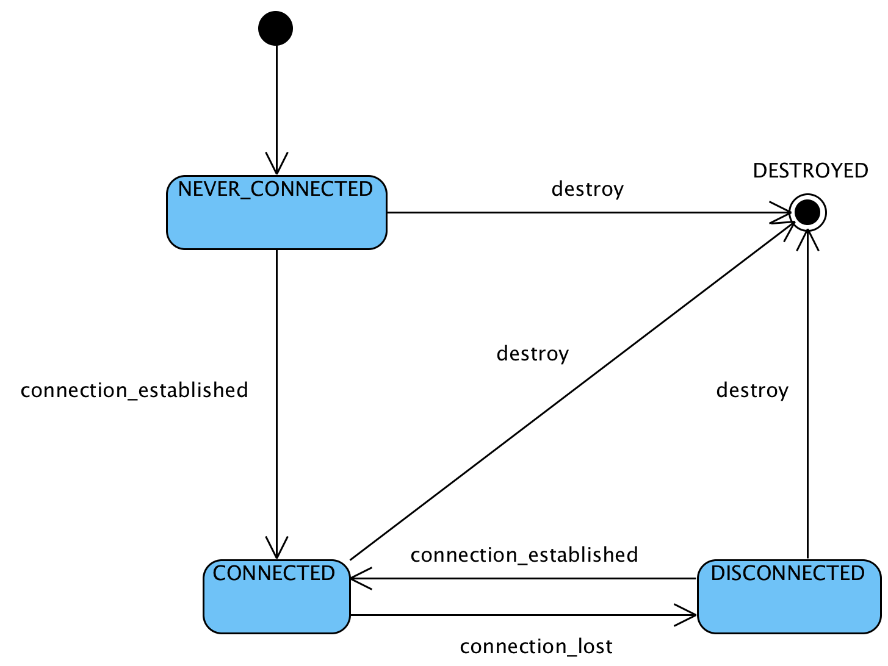
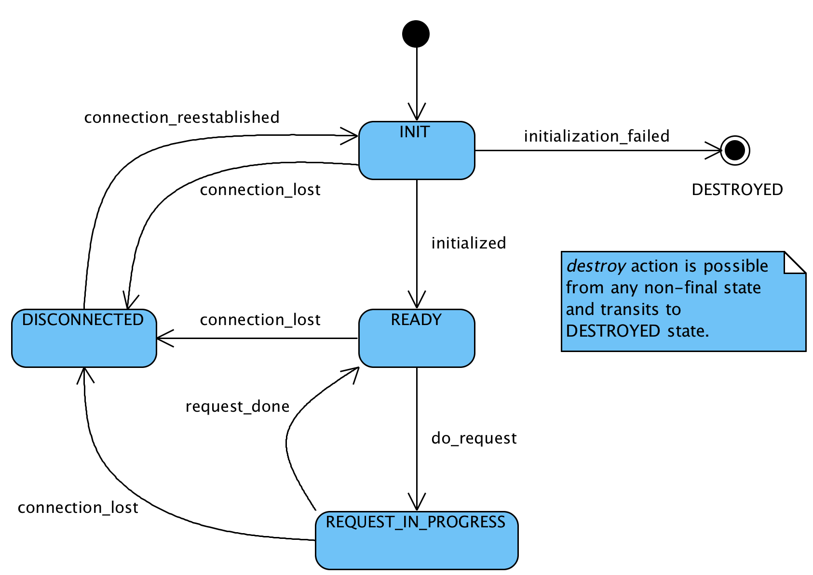

# pvAccess Protocol Specification

[Back to main](protocol)

1.  [Connection Management](#connection-management)
2.  [Channel Life-cycle](#channel-life-cycle)
3.  [Channel Request Life-cycle](#channel-request-life-cycle)
4.  [Flow Control](#flow-control)
    1.  [Flow Control Example](#flow-control-example)
5.  [Channel Discovery](#channel-discovery)
6.  [Communication Example](#communication-example)

## Connection Management

pvAccess uses the concept of a "channel" to denote a connection to a
single named resource that resides on some server. Channels are
subordinate to the TCP connection between a client and server: a channel
can only be created if a TCP connection has already been established;
likewise, if the TCP connection is terminated, then all subordinate
channels are implicitly destroyed.

Each TCP connection has associated Quality of Service (QoS) parameters.
Regardless of how many channels are handled by either client or server,
each client and server pair MUST be connected with exactly one TCP
connection for each QoS parameter value.

When establishing a TCP connection, a simple handshake MUST be
performed. The client opens a TCP connection to the server and waits
until the Connection Validation message is received. The server MUST
initially send a Set byte order control message to notify the client
about the byte order to be used for this TCP connection. After that the
server MUST send the Connection Validation message. If the client
correctly decodes messages it MUST respond with a Connection Validation
response message. Now the connection is verified and the client may
start sending requests. The client SHOULD keep the connection
established until the last active channel gets destroyed. However, to
optimize resource reallocation it MAY delay connection destruction.

Both parties MUST constantly monitor whether the connection is valid and
not simply rely on TCP mechanisms. pvAccess achieves this by sending
some small amount of data with a minimum period. If there is no send
operation otherwise called within a predetermined period of time (SHOULD
be 15 seconds), an echo message MUST be sent. In case of connection
failure, TCP will report a connection loss on send. If there is no
response in a predetermined period of time, the connection SHOULD be
marked as unresponsive. An echo message MUST be periodically sent until
a response is received or the connection is reported to be lost. If an
echo response is received and transport is marked as unresponsive, then
transport SHOUD be reported to be responsive.

Connection State Diagram.

When connection is terminated all related resources MUST be freed. On
the server side all channels including their requests MUST be destroyed
(this includes all *serverChannelID*s). On the client side all channels
and their requests MUST be put to disconnected state and searching for
channels initiated. *clientChannelID*s and *requestID*s SHOULD be
retained until channel or request are destroyed on client side. Once IDs
are freed they MAY be recycled - used for other channels/requests in the
future.

When disconnected client channels are found on the network and
connection is re-established, channels are put back to connected state
and all their requests re-initialized; in addition, monitors are
re-started.

## Channel Life-cycle

Channel State Diagram.

When a channel is instantiated by a client application, its state MUST
be set to a NEVER\_CONNECTED state. This indicates that the channel is
currently being connected for the first time. The connection proccess
within the client MUST repetedly attempt to find a server hosting the
channel by broadcasting or multicasting channel search requests. When a
server response is received, the client MUST connect to the server
responding to the search request using the protocol and address data
from the search request response. If a connection has already been
established by the client, it MUST be reused. A client API MAY also
allow a user-specified server address; in this case, the searching
process would be bypassed and the specified server address data used
directly.

When a connection is established and verified, a channel create request
message MUST be sent by the server. When the client receives a channel
create response message with a success status, it MUST set the channel
to the CONNECTED state.

A channel MUST be in a CONNECTED state to be able to accept channel
related requests.

When the connection is lost, the channel state MUST be set to
DISCONNECTED. In this state, clients MUST start the connection process
as described above. On reconnect, the channel's state MUST be set back
to CONNECTED.

A channel MAY be destroyed any time (in any state) and then its state
MUST be set to DESTROYED. Once the channel is destroyed, it MUST NOT be
used anymore.

## Channel Request Life-cycle

Channel Request State Diagram.

Channel requests (get, put, get-put, RPC, process) have a state. When
instantiated, they MUST be set to the INIT state. A specific per request
initialization message MUST be sent to the server. The request MUST NOT
be used until a successful initialization response is received from the
server and put to the READY state. If initialization fails, the client
MUST be notified about the failure and the request put to the DESTROYED
state.

Actual actions, e.g. get, MAY only be invoked when a request is in the
READY state. When one action is in progress, the request is put into the
REQUEST\_IN\_PROGRESS state and set back to the READY state when the
action is completed. This implies that actions MUST NOT be run in
parallel.

When a connection is lost, a request MUST be put into the DISCONNECTED
state and automatically reinitialized when the connection is
reestablished (as if the request were newly instantiated).

A pending request MAY be canceled. Actual cancellation MAY be ignored,
however completion of the request MUST be always reported via request
completion callback mechanism.

A request MAY be destroyed at any time (in any state) and then its state
MUST be set to DESTROYED. Once the request is destroyed, it MUST NOT be
used anymore.

## Flow Control

This section is **not** intended to be
[normative](http://epics-pvdata.sourceforge.net/charter.html#normative).
It is given only to help developers write agents that implement pvAccess
optimally with respect to monitoring. This section does not describe the
protocol itself.

A pvAccess implementation SHOULD implement flow control such that each
endpoint should try to send as much monitoring data as it can subject to
an upper limit calculated with respect to the amount of the other
party's free receive buffer size. Were this limit to be reached,
monitors would start piling up in the monitors' circular buffer queues.

Usually flow control algorithms wait for congestion to occur before they
are triggered. They are causal. However, due to the isolated nature of
TCP connection - there are always only two parties involved - it is
possible to predict congestions using the following algorithm:

  - Both parties exchange their receive socket and local buffer sizes
  - Periodically, i.e. every N bytes, they send a control message
    marking the total number of bytes sent to the other party
  - When the other party receives the control message it responds with a
    complementary control message indicating the received marker value.
    This acknowledges the reception of total bytes sent
  - The difference between the total bytes sent and the last
    acknowledged marker received gives an indication of how full the
    other party's receive buffers are. This number should never exceed
    the total sum of receive buffer sizes.

Flow control is needed only to optimize subscription messages back to
the client (i.e. monitors). For other messages TCP flow control is
sufficient.

A pvAccess implementation SHOULD implement flow control such that each
endpoint should try to send as much monitoring data as it can subject to
an upper limit calculated with respect to the amount of the other
party's free receive buffer size. Were this limit to be reached,
monitors would start piling up in the monitors' circular buffer queues.

### Flow Control Example

The intention of flow control is to avoid having the following behavior,
which typically results from pure TCP flow control:

  - Let's assume the client's Rx buffers are full.
  - The server sends monitors until TCP detects the client's Rx buffer
    is full.
  - After some time the client's Rx buffer is immediately emptied. This
    is a consequence of the fact that bulk reads are made from the
    socket rather than reading message by message (because OS calls are
    expensive).
  - Server starts sending monitors until all the buffers are full (the
    server will fill all the buffers before the client actually
    processed received monitors\!).

Such situations as described above would result in monitors like the
following (identified by their sequential
    number):

    0 1 2 3 4 (buffers full) 7 8 9 10 11 12 (buffers full) 22 23 24 25 26 27 28 (buffers full)

Flow control can make this
    better:

    0 1 2 3 4 (buffers full) 7 8 (buffers still full, but for less time since the server would send only as much as the client can handle) 10 11 (...) 14 15 (...) 18 19

The result is more fluid and up-to-date arrival of monitors, which
overcomes the combined problems of slow processing and large buffers.

Requiring flow control (in addition to already existing monitor queues)
would add complexity to the protocol's implementation. It needs to be
decided whether the above flow control should be specified as part of
the normative specification, or only suggested non-normatively. At
present, it is only suggested.

## Channel Discovery

pvAccess uses a broadcast/multicast channel discovery mechanism using
UDP; search messages are usually sent to broadcast addresses and servers
hosting searched channels respond with a message containing their server
address and port. In addition pvAccess transparently supports multicast,
if an address is a multicast address the implementation SHOULD
transparently handle it. That is, it should join the multicast group in
order to receive multicast messages.

Possible future addition: UDP congestion control should be added to the
specification to prevent the possibility of poor implementations
flooding a network with UDP search messages. Currently a simple and
robust algorithm is used in the reference implementation. The optimality
of the algorithm should to be verified and added to this specification.

## Communication Example

The following table illustrates messages sent between a client and a
server where the client issues a get request on a channel.

|    Server                    |                            | Client                                  |
| ---------------------------- | -------------------------- | --------------------------------------- |
|                              | \<----                     | searchRequest (UDP broadcast/multicast) |
| searchResponse (UDP unicast) | \----\>                    |                                         |
|                              | TCP connection established |                                         |
| setByteOrderControlMessage   | \----\>                    |                                         |
| connectionValidationRequest  | \----\>                    |                                         |
|                              | \<----                     | connectionValidationResponse            |
|                              | \<----                     | createChannelRequest                    |
| createChannelResponse        | \----\>                    |                                         |
|                              | \<----                     | channelGetRequestInit                   |
| channelGetResponseInit       | \----\>                    |                                         |
|                              | \<----                     | channelGetRequest                       |
| channelGetResponse           | \----\>                    |                                         | 
|                              | \<----                     | ...                                     |
| ...                          | \----\>                    |                                         |
|                              | \<----                     | destroyRequest                          |
|                              | \<----                     | channelDestroyRequest                   |
| channelDestroyResponse       | \----\>                    |                                         |
